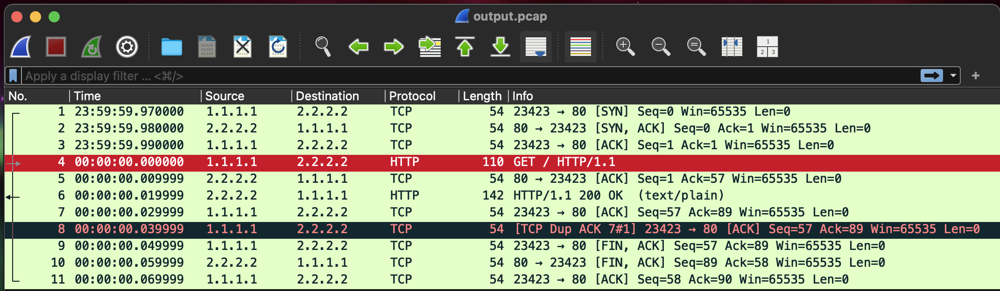

# Fakepcap

A Python tool to create a synthetic pcap from arbitrary request and and response data. Particularly useful to create pcaps from decrypted TLS connections, and evaluate them with intrusion detection tools such as [Suricata](https://suricata.io).

# Requirements
* Python 3.8+
* [dpkt](https://github.com/kbandla/dpkt/)

# Example

```python
from fakepcap import FakePcap

# Create a FakePcap instance with the path to the output file
fp = FakePcap("output.pcap")

# Add some sent data, with srcip/port and dstip/port tuple
request = b"\r\n".join([b"GET / HTTP/1.1", b"Host: example.com", b"Connection: close", b"", b""])
fp.add("1.1.1.1", 23423, "2.2.2.2", 80, request, timestamp=1564617600.0)

# Add the response data, with the 4-tuple reversed to indicate the direction
response = b"\r\n".join([b"HTTP/1.1 200 OK", b"Content-Type: text/plain", b"Content-Length: 20", b"", b"Sure! Here's some data!"])
fp.add("2.2.2.2", 80, "1.1.1.1", 23423, response, timestamp=1564617600.0)

# Save the file
fp.save()
```

## Load the pcap in Wireshark
[](wireshark.png)
